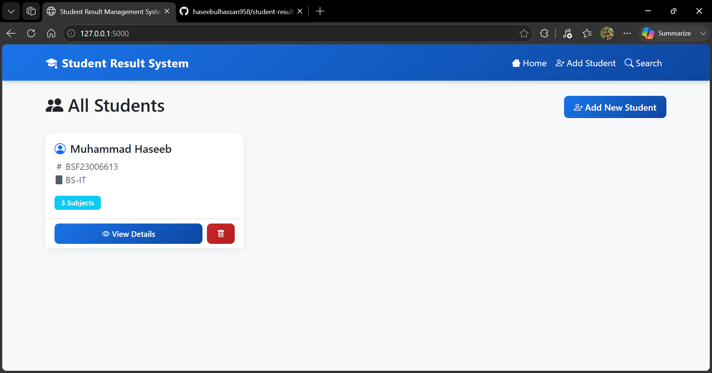
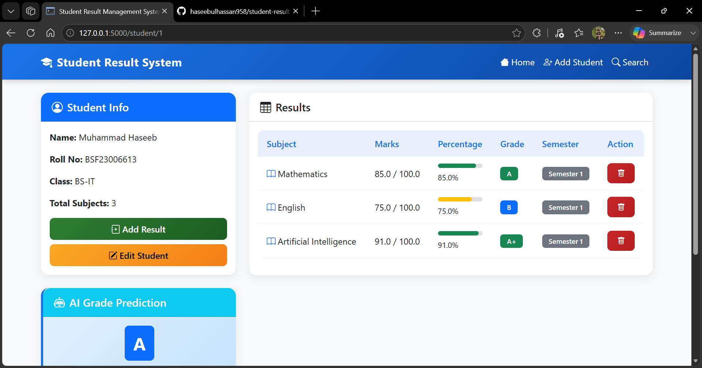
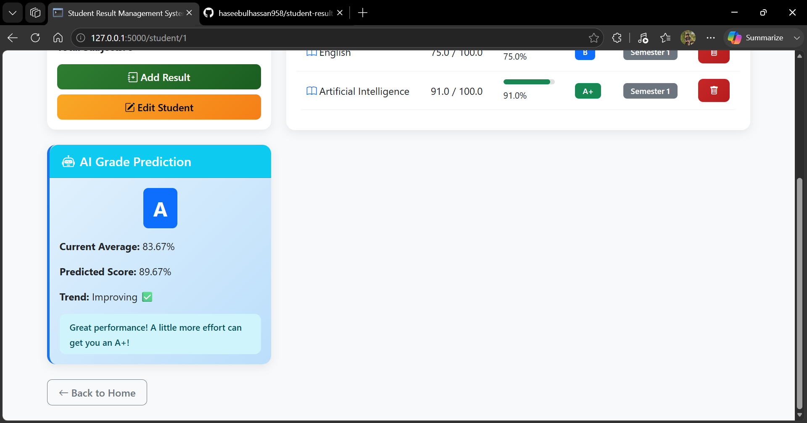
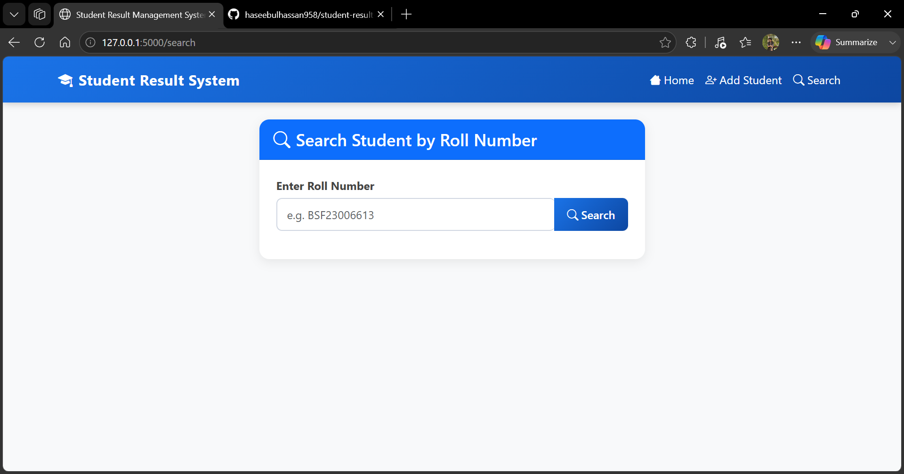

# Student Result Management System

A web-based Student Result Management System built with Flask, SQLite, and AI-powered grade prediction using NumPy.

## Screenshots

### Home Page


### Student Detail & AI Prediction



### Search Student


## Features

- Add, edit, and delete students
- Add and delete subject results
- Automatic grade and percentage calculation
- Progress bar visualization for each subject
- AI-powered next semester grade prediction
- Flash notifications for all actions
- Fully responsive UI with Bootstrap 5

## Tech Stack

| Layer | Technology |
|---|---|
| Frontend | HTML, CSS, Bootstrap 5, Bootstrap Icons |
| Backend | Python, Flask |
| Database | SQLite, Flask-SQLAlchemy |
| AI/ML | NumPy |

## Project Structure

```
student_result_system/
│
├── app.py                  # Flask main application and routes
├── models.py               # Database models (Student, Result)
├── predictor.py            # AI grade prediction logic
├── README.md               # Project documentation (Markdown)
├── README.txt              # Project documentation (Text)
│
├── templates/
│   ├── base.html           # Base template (navbar, layout)
│   ├── index.html          # Home page - all students
│   ├── add_student.html    # Add new student form
│   ├── edit_student.html   # Edit student form
│   ├── add_result.html     # Add result form
│   └── student_detail.html # Student detail and AI prediction
│
├── static/
│   ├── css/                # Custom stylesheets
│   └── js/                 # Custom JavaScript
│
└── venv/                   # Virtual environment
```

## Installation and Setup

### Step 1 - Clone the repository
```
git clone https://github.com/yourusername/student_result_system.git
cd student_result_system
```

### Step 2 - Create virtual environment
```
python -m venv venv
venv\Scripts\activate
```

### Step 3 - Install dependencies
```
pip install flask flask-sqlalchemy scikit-learn pandas numpy
```

### Step 4 - Run the application
```
python app.py
```

### Step 5 - Open browser
```
http://127.0.0.1:5000
```

## How AI Grade Prediction Works

1. Collects all subject results of a student
2. Calculates percentage for each subject
3. Analyzes performance trend (improving or declining)
4. Predicts next semester grade based on current average and trend
5. Displays predicted grade, score, and personalized message

## Grade Scale

| Percentage | Grade |
|---|---|
| 90% and above | A+ |
| 80% - 89% | A |
| 70% - 79% | B |
| 60% - 69% | C |
| 50% - 59% | D |
| Below 50% | F |

## Developer

Name: Muhammad Haseeb Ul Hassan
Degree: BS Information Technology - AI Development
University: University of Education Lahore

## License

This project is open source and available under the MIT License.
